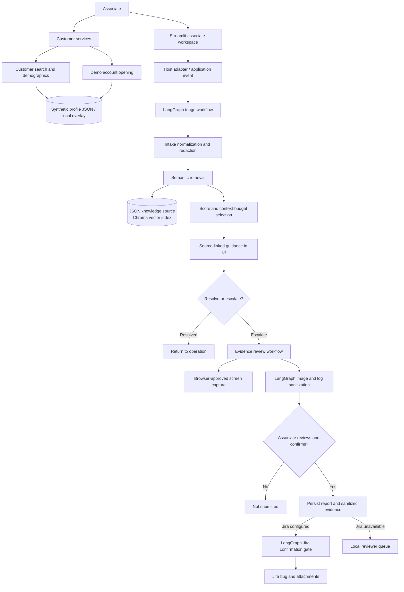

# ResolveDesk Agentic AI Solution

## Executive Summary

SmartIssue is a Streamlit prototype for helping a banking associate diagnose a failed customer operation, find relevant support guidance, gather reviewed evidence, and escalate a confirmed issue to Jira. LangGraph coordinates the triage, evidence-processing, and Jira workflows. Local embeddings and Chroma provide knowledge retrieval. Issue drafting can use a configured OpenRouter model when explicitly approved in the UI, optional local Ollama, or a fact-only template.

The application is a human-in-the-loop workflow, not an autonomous banking agent. The associate performs or observes the customer operation, reviews suggested guidance, approves screen sharing, reviews the issue and evidence, and confirms escalation. The repository currently simulates the banking application and host event source; it is not connected to a live bank system.

## System Architecture



### Main Components

| Component | Responsibility |
| --- | --- |
| `app.py` | Streamlit workspace, issue workflow, support guidance, evidence review, report tracker, and reviewer queue. |
| `smartissue/host_adapter.py` | Typed application error event and an in-process adapter for approved host diagnostic logs. The demo emits sample events and logs. |
| `smartissue/agent.py` | Local JSON ingestion, Chroma synchronization, semantic retrieval, context budgeting, and optional fact-grounded issue drafting. |
| `smartissue/graphs/state.py` | Shared typed state contract for triage nodes. |
| `smartissue/graphs/triage.py` | Top-level LangGraph supervisor; composes intake, resolution, and issue-summary subgraphs and provides the `run_triage` entry point. |
| `smartissue/agents/` | Specialist LangGraph subgraphs: intake/redaction, semantic resolution/context budgeting, and issue-summary drafting. |
| `smartissue/customers.py` | Customer search, demographic validation, and local demo account-opening persistence. |
| `smartissue/evidence.py` | LangGraph workflow that strips image metadata, resizes images, and redacts secrets and common identifiers from text logs. |
| `smartissue/screen_capture.py` and `components/screen_capture/index.html` | Browser component for permission-gated scroll capture. The associate selects the current tab, scrolls through the issue page, and stops sharing to stitch the captured views into evidence. |
| `smartissue/reports.py` | Associate-confirmed report validation, evidence persistence, and review status transitions. |
| `smartissue/jira.py` | LangGraph confirmation gate, Jira Cloud bug creation, and screenshot/log attachment upload. |
| `data/knowledge_base.json` | Sample support knowledge articles used by the local retrieval pipeline. |
| `data/customer_profiles.json` | Synthetic customer seed records for search, demographic editing, and account-opening demonstrations. |

### Customer Services Demo

The app opens on Customer search. Selecting a match provides navigation to Payments or Customer services, and the selected profile populates either workspace. Customer services contains Demographics and Open an account tabs. Submitting either operation shows its typed error at the top of the same page. The associate explicitly clicks Need resolution to run LangGraph/Chroma triage and open source-cited Resolution insights on the left, then can mark guidance tried, resolve the request, or capture evidence and escalate through the existing associate-confirmed report/Jira flow. The report retains the customer reference and matched knowledge IDs. The committed profile JSON contains synthetic `.test` contact details only. On first edit, the app copies those records to `.data/customer_profiles.json`, an ignored local runtime file. These actions do not connect to a banking core, verify customer identity, or create real accounts; production use requires authenticated customer data and approved account-opening controls.

### Triage Graph Structure

The triage supervisor is a sequential LangGraph composition. Each specialist is independently compiled as a subgraph and shares the `IssueState` contract:

```text
START
    -> intake_agent (normalize_and_redact)
    -> resolution_agent (semantic_retrieval -> token_budget_optimizer)
    -> issue_summary_agent (fact_grounded_issue_draft)
    -> END
```

The UI and host adapter call `smartissue.graphs.run_triage`; local indexing and retrieval stay in `smartissue.agent`. This keeps orchestration, agent nodes, shared graph state, and RAG infrastructure discoverable as separate responsibilities.

## Agent Workflows

### Triage and Guidance

The triage graph runs three specialist subgraphs in sequence:

1. **Intake** normalizes the title and description and redacts emails and common numeric identifiers before search.
2. **Resolution** embeds the query, searches Chroma, filters low-scoring chunks, groups chunk matches into source articles, and applies the configured token budget.
3. **Issue summary** creates a factual issue draft only when requested. With `OPENROUTER_API_KEY` configured, the associate can explicitly opt in to sending redacted issue details and retrieved support references to the configured OpenRouter model. Otherwise, the node can use configured local Ollama or a deterministic fact-only template. The UI reports which provider produced the draft.

The retrieved knowledge articles and their source IDs are presented to the associate as guidance and are included as references when drafting with a language model. Graph nodes follow a defined flow; they do not perform autonomous planning or dynamically choose tools.

### Evidence Processing

When “Still failing · raise issue” is selected, the browser requests screen-sharing permission. The associate selects the current application tab, scrolls through the issue page, and stops sharing to finish a stitched capture of the visited page sections. Browser security requires this approval; the application cannot silently capture a screen. The app also creates an automatic diagnostic bundle from the host error event, attempted resolution steps, and retrieved support-note IDs. The evidence review screen previews the stitched capture and log; it has no screenshot or log upload controls.

The evidence graph sanitizes image content and metadata and redacts common secrets and identifiers in logs. The report service persists sanitized evidence with the issue details. The current automatic host diagnostics include the demo event or permitted runtime metadata; actual console/network logs require the bank application's authenticated connector.

### Jira Escalation and Review

The associate must confirm the escalation before Jira creation. When Jira is enabled and configured, the Jira graph creates a Bug issue and uploads available sanitized screenshot and diagnostic-log attachments. Jira credentials are read from server-side environment variables. If Jira is disabled or unavailable, the report remains in local storage for reviewer follow-up. The reviewer queue supports approval or rejection; approving a pending report can create the Jira issue.

## JSON Knowledge Ingestion and Retrieval

The JSON article schema requires `id`, `title`, `summary`, `category`, `updated`, and a string-array `steps`. Ingestion validates the source, rejects duplicate IDs and empty source files, normalizes and redacts text, and creates versioned `article_overview` and `resolution_step` JSON chunks.

Stable chunk IDs and SHA-256 content hashes drive batched upserts and deletion of stale chunks. The collection name includes the chunk schema version and embedding-model hash so the new JSON layout does not overwrite the prior monolithic index. The index uses local Chroma persistence and cosine similarity.

At retrieval, the system embeds the redacted query, over-fetches candidate chunks, applies `MIN_RETRIEVAL_SCORE`, optionally filters by category, groups matches back to source articles, and returns source IDs, chunk IDs, matched chunk types, scores, and relevant steps. It applies `MAX_RESULTS` and `MAX_CONTEXT_TOKENS` limits before returning guidance.

The knowledge base is cached by the running Streamlit process and synchronized when first initialized. Restart the app after changing the JSON source to trigger synchronization. The Knowledge base page displays the startup ingestion counts.

## Data and Privacy Boundaries

- Issue text and JSON knowledge text are redacted before embedding or local persistence. Diagnostic logs are passed through the evidence redactor before report persistence or Jira attachment.
- Captured image metadata is removed; supported screenshots are resized and size-limited.
- Jira is disabled by default. Jira credentials must stay in server-side environment configuration and must not be committed.
- Browser screen capture requires explicit associate permission. Browser JavaScript cannot read DevTools logs directly.
- `ApprovedHostAppConnector` is an in-process adapter, not an authenticated network service. The real host application must authenticate its event source and call the adapter from a trusted integration boundary.
- Sample knowledge articles, host events, reviewer identity, and the Payments workspace are demonstrations, not bank-approved or live production data.

## Configuration and Local Run

Python 3.11 or newer is recommended. From the repository root:

```powershell
py -3.13 -m venv .venv
.venv\Scripts\Activate.ps1
python -m pip install -r requirements.txt
Copy-Item .env.example .env
streamlit run app.py
```

Open `http://127.0.0.1:8501`. On first launch, the embedding model may download to `.data/models`. For offline use, pre-provision the model and set `ALLOW_MODEL_DOWNLOADS=false`.

Relevant settings:

| Setting | Purpose |
| --- | --- |
| `EMBEDDING_MODEL_ID` | Embedding model ID. |
| `ALLOW_MODEL_DOWNLOADS` | Controls model downloads. |
| `MODEL_CACHE_PATH` | Local embedding/tokenizer cache. |
| `CHROMA_PATH` | Persistent local vector index directory. |
| `MIN_RETRIEVAL_SCORE` | Minimum similarity score for returned chunks. |
| `MAX_CONTEXT_TOKENS` | Maximum retrieved context token count. |
| `OPENROUTER_API_KEY`, `OPENROUTER_MODEL`, `OPENROUTER_BASE_URL` | Optional OpenRouter chat API and model for issue drafting; external transmission requires associate opt-in. Defaults to `nvidia/nemotron-3-ultra-550b-a55b:free`. |
| `OLLAMA_MODEL`, `OLLAMA_BASE_URL` | Optional local model fallback for issue-summary drafting. |
| `JIRA_ENABLED`, `JIRA_BASE_URL`, `JIRA_EMAIL`, `JIRA_API_TOKEN`, `JIRA_PROJECT_KEY` | Server-side Jira configuration. |

Run tests with:

```powershell
python -m unittest discover -s tests -v
```

The test suite covers workflow composition, PII redaction, JSON chunk creation, repeatable ingestion, update/deletion reconciliation, filtered retrieval, evidence sanitization, report persistence, and Jira gating/attachment handoff. Retrieval tests use an isolated Chroma index and deterministic fake embeddings; they do not establish relevance quality for the production embedding model.

## Production Readiness Boundaries

The repository provides an end-to-end local prototype, not a bank-certified production deployment. A production rollout still needs:

- Integration with the real banking host's authenticated error and diagnostic APIs.
- Organization authentication, associate/reviewer authorization, and audit identity.
- Bank-approved privacy, retention, redaction, and evidence handling policies.
- A labeled retrieval evaluation set, relevance metrics, and controlled threshold/model changes.
- Monitoring for ingestion/index failures, retrieval quality, latency, empty results, Jira errors, and attachment failures.
- Durable, backed-up vector/report storage and a concurrency strategy for multiple app instances.
- Deployment secrets management, operational alerts, and incident/recovery procedures.

For the RAG ingestion and retrieval details, see [RAG_SOLUTION.md](RAG_SOLUTION.md).
