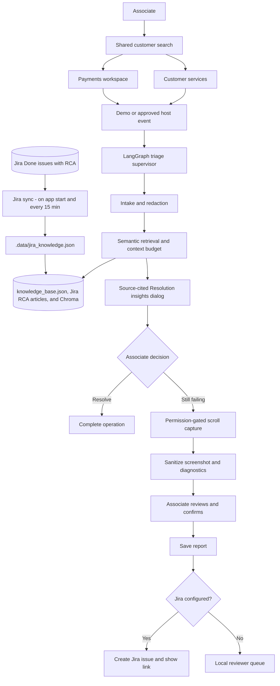
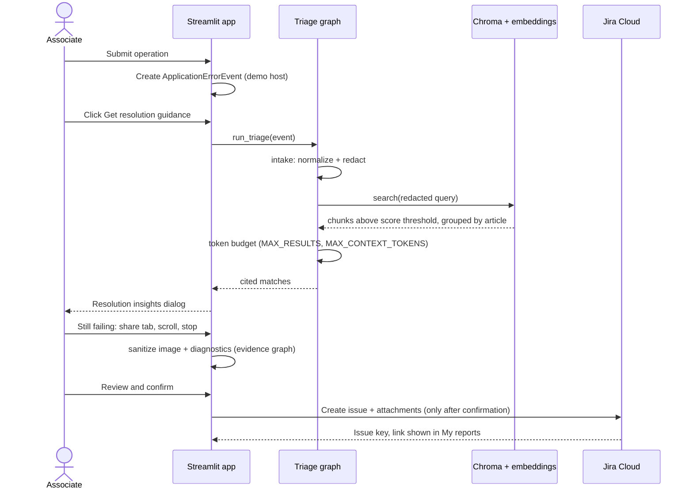
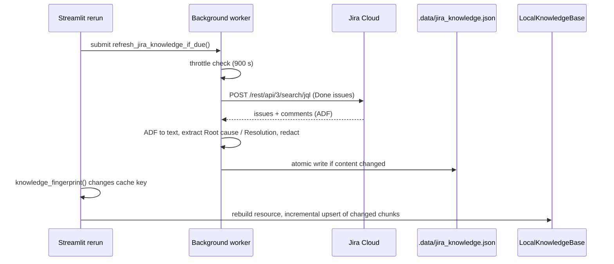
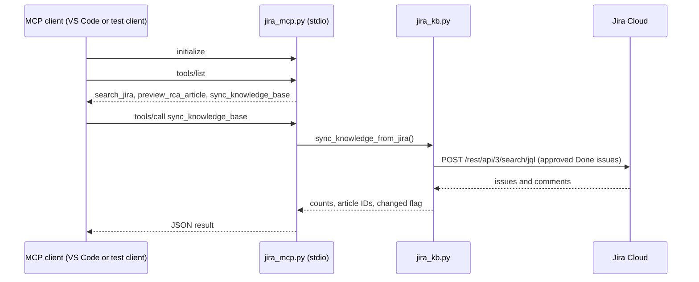

# ResolveDesk Architecture and Learning Guide

This guide explains how the ResolveDesk prototype fits together and introduces the Streamlit, LangGraph, and RAG concepts used by the code. It is intended as a code-reading path for someone learning the architecture, not as a claim that the demo is connected to a production banking system.

## 1. The Big Picture

ResolveDesk is a human-in-the-loop support application. Streamlit provides the associate UI. Python services adapt customer or payment operations into typed error events. LangGraph coordinates intake, retrieval, and optional issue drafting. A local JSON knowledge base is embedded and searched in Chroma. The associate reviews guidance, chooses whether to resolve or escalate, reviews evidence, and confirms any Jira handoff.



## 2. A Request Through the System

### Customer or Payment Operation

1. The associate searches for a customer. The selected profile is shared across the Payments and Customer services workspaces.
2. Continuing a demo operation creates an `ApplicationErrorEvent` in `smartissue/host_adapter.py`. Customer demographics and account-opening demos use distinct error codes.
3. The error appears on the same page as the operation form. Customer profile values remain visible; pending local changes are not committed yet.
4. In both workspaces the associate clicks **Get resolution guidance** after the error appears. Triage runs only then, and a modal **Resolution insights** dialog opens with cited KB guidance; afterwards an **Open resolution insights** button reopens it. Nothing is shown at the right of the page until an error exists.
   The screen-capture button lives on the page, not in the dialog, so closing the dialog does not end a capture.
5. The associate can mark the suggested resolution as tried, complete the operation, or raise an issue.

The demo error generator is deliberately repeatable: the same workflow produces the same error type and content, with a fresh event ID each time. It is not a real banking-core operation.

### Evidence and Jira

The browser capture component requests explicit tab-sharing permission. It records changed viewport frames while the associate scrolls, then stitches those frames into a single image when sharing stops. `smartissue/evidence.py` validates, resizes, and sanitizes the image and diagnostic bundle. The associate reviews the result and confirms before report persistence or Jira submission.

Jira is optional. When configured and the server returns an issue key, the report UI builds an **Open Jira issue** link from the configured Jira site. Without valid configuration, the confirmed report is stored locally for review.

## 3. LangGraph Concepts in This Project

LangGraph represents the triage workflow as a stateful directed graph. The project uses `StateGraph` to define nodes and edges, then calls `compile()` to create a runnable graph.

### Shared State

`smartissue/graphs/state.py` defines `IssueState`, a `TypedDict` describing values passed between nodes: title, description, redacted query, retrieved matches, token counts, and optional issue draft. Each node returns a partial dictionary update; LangGraph merges updates into the shared state.

### Nodes and Edges

`smartissue/graphs/triage.py` is the supervisor. It connects three specialist subgraphs in a deterministic sequence:

```text
START -> intake_agent -> resolution_agent -> issue_summary_agent -> END
```

- **Intake** (`smartissue/agents/intake.py`) normalizes and redacts the issue text, then produces the retrieval query.
- **Resolution** (`smartissue/agents/resolution.py`) searches the local knowledge base and enforces the token budget.
- **Issue summary** (`smartissue/agents/issue_summary.py`) drafts a report only when requested. It uses approved optional providers or a fact-only fallback.

These are compiled specialist subgraphs composed by a supervisor. They do not autonomously plan or select tools; the graph follows the edges declared in code. `smartissue/evidence.py` and `smartissue/jira.py` contain separate graphs for evidence sanitization and Jira confirmation/creation.

## 4. RAG: JSON to Cited Guidance

RAG means retrieval-augmented generation or, in this UI, retrieval-augmented support guidance. Retrieval is separate from issue generation.

1. `data/knowledge_base.json` contains articles with `id`, `title`, `summary`, `category`, `updated`, and `steps`.
2. `smartissue/agent.py` validates and redacts text, then creates overview and per-step JSON chunks.
3. `sentence-transformers/all-MiniLM-L6-v2` converts chunks to local vector embeddings.
4. Chroma stores the vectors locally in `.data/chroma` and searches by cosine distance.
5. Results below `MIN_RETRIEVAL_SCORE` are filtered. Chunk hits are grouped by source article and limited by `MAX_RESULTS` and `MAX_CONTEXT_TOKENS`.
6. The UI displays the source article ID/category next to the guidance, so the associate can inspect the source before acting.

The first local model/index initialization is warmed in the background from Customer search. The first resolution request can wait for that warm-up if clicked immediately; subsequent queries reuse the initialized resources.

## 5. Streamlit Concepts in This Project

Streamlit reruns `app.py` after interactions. `st.session_state` carries user/workflow state across reruns: selected customer, active error, active step, attempted guidance, and evidence. Widgets with stable `key` values preserve form selections. Forms batch edits and submit them together; tabs group Demographics and Open an account while keeping the selected tab across reruns.

The shared customer search is outside the workspace-specific tabs. A successful match sets `current_customer_id`, and both workspaces call `get_current_customer()` to populate their details. The Customer search landing page offers explicit navigation to Payments or Customer services after selection.

`st.cache_resource` keeps expensive knowledge resources available for the running process. A background `ThreadPoolExecutor` starts this warm-up without blocking the Customer search landing page. Streamlit session state remains per browser session; local profile/report/vector files are shared by the local process.

## 6. Main Libraries

| Library | Role here |
| --- | --- |
| Streamlit | Python UI, widgets, forms, tabs, reruns, and session state. |
| LangGraph | Typed, compiled workflow graphs for triage, evidence, and Jira. |
| Sentence Transformers | Local text embeddings for support articles and queries. |
| ChromaDB | Persistent local vector collection and semantic nearest-neighbor search. |
| Transformers | Tokenizer used to enforce the retrieved-context budget. |
| Pillow | Decode, resize, stitch, and sanitize captured evidence images. |
| Requests | OpenRouter and Jira Cloud HTTP APIs. |
| python-dotenv | Load ignored local `.env` configuration. |
| langchain-ollama | Optional local Ollama issue-drafting fallback. |

## 7. Styling and Interaction

The app-level CSS in `app.py` defines a white canvas and reusable color variables for bank blue, red, and purple accents. DM Sans is used for UI text and DM Mono for compact metadata. Primary buttons are filled bank blue with white text; secondary buttons and link buttons are blue outlines, so one color family is used everywhere. Descendant button text is styled explicitly because Streamlit renders labels inside nested elements, which otherwise inherit the muted paragraph color.

Workspace navigation, global customer search, tabs, forms, metrics, resolution cards, and evidence review are standard Streamlit components. The screen-capture button is an iframe component because browser display permission must be requested from client-side JavaScript.

## 8. Code Map

| Path | Responsibility |
| --- | --- |
| `app.py` | UI routing, customer selection, operation/error screens, evidence review, reports, and resource warm-up. |
| `smartissue/customers.py` | Profile search, validation, local demographic updates, and demo account records. |
| `smartissue/host_adapter.py` | Typed demo/host events and error-to-triage adapter. |
| `smartissue/graphs/state.py` | Shared triage state schema. |
| `smartissue/graphs/triage.py` | Triage supervisor and `run_triage` entry point. |
| `smartissue/agents/` | Intake, resolution, and issue-summary subgraphs. |
| `smartissue/agent.py` | Knowledge ingestion, Chroma sync/search, redaction helpers, and issue drafting. |
| `smartissue/evidence.py` | Scroll-frame image stitching, sanitization, and diagnostic redaction graph. |
| `smartissue/reports.py` | Associate-confirmed report persistence and Jira handoff. |
| `smartissue/jira.py` | Jira configuration checks, issue creation, attachment upload, issue URLs, and read-only JQL search (`search_jira_issues`). |
| `smartissue/jira_kb.py` | Extracts `Root cause:` / `Resolution:` text from Jira issues and writes `.data/jira_knowledge.json`. |
| `smartissue/text.py` | Shared `redact_sensitive_text` and `clean_text` helpers (re-exported by `agent.py`). |
| `mcp_server/jira_mcp.py` | MCP server (stdio) exposing Jira search, article preview, and knowledge sync. Registered in `.vscode/mcp.json`. |
| `data/knowledge_base.json` | Sample support articles. |
| `data/customer_profiles.json` | Synthetic customer profile seed data. |

## 9. Privacy and Production Boundaries

Customer profiles in the committed JSON are synthetic `.test` records. Demographic and demo account changes are stored in ignored `.data/customer_profiles.json`; they do not update a bank. Reports and Chroma data are also local under `.data/`. `.env` is ignored and must never be committed. Rotate credentials that have been exposed in chat.

Screen capture requires the associate to approve Chrome’s sharing prompt, choose the app tab, scroll, and stop sharing. No browser can silently capture a screen. A production deployment still requires authenticated host events, identity/authorization, bank-approved data sources and policy, durable storage, audit controls, monitoring, and an approved Jira connection.

## 10. Python Building Blocks Used Here

This project is useful for learning Python because the framework calls sit on top of ordinary Python modules, functions, dictionaries, dataclasses, files, and exceptions. The code uses these standard pieces to define clear boundaries between UI, customer records, retrieval, and integrations.

### Modules and imports

Each `.py` file is a Python module. Imports express ownership:

- `app.py` owns the Streamlit UI and the associate workflow.
- `smartissue/customers.py` owns customer JSON validation and local persistence.
- `smartissue/agent.py` owns knowledge ingestion, vector search, and issue drafting.
- `smartissue/graphs/` and `smartissue/agents/` own LangGraph state and orchestration.
- `smartissue/host_adapter.py`, `evidence.py`, `reports.py`, and `jira.py` own integration boundaries.

Heavy imports are intentionally local in `app.py`. Customer search can render before the embedding model and graph are imported. They are loaded when the associate requests resolution, or warmed in the background while Customer search is open.

### Dictionaries, types, and dataclasses

Python dictionaries hold JSON-shaped article, customer, session, and report records. `IssueState` in `smartissue/graphs/state.py` is a `TypedDict`: it documents the keys shared between graph nodes while remaining a normal dictionary at runtime. `ApplicationErrorEvent` in `smartissue/host_adapter.py` is a frozen dataclass; it groups related event fields into one value, and `to_dict()` serializes it for Streamlit session state.

`Workflow` is a `Literal` type alias for supported operation names. Type annotations tell editors and readers what values are expected, but they do not replace runtime checks. For example, `customers.py` still validates supported account products, required fields, dates, and email syntax at runtime.

### Files, JSON, and atomic writes

The standard-library `json` module reads and writes the profile and knowledge files. `pathlib.Path` builds filesystem paths. `hashlib.sha256` fingerprints the knowledge source and article chunks. `uuid.uuid4()` creates event, account, and report IDs. Customer writes go to a temporary file and then use `Path.replace()`, avoiding partially written JSON documents.

### Exceptions and context managers

`try`/`except` blocks translate expected errors into messages associates can act on. `with` blocks manage resources and UI scope: they appear around `Path.open()`, Streamlit forms/containers, test temporary directories, and Pillow images. The app catches expected I/O, validation, and request failures; unexpected programming errors should remain visible during development.

### Caching and background work

`functools.lru_cache` and `st.cache_resource` reuse the local model/index and compiled graph in the running process. The knowledge JSON hash participates in the cache key, so editing the source produces a new cached resource. A single-worker `ThreadPoolExecutor` begins model/index initialization while the associate searches for a customer. The returned `Future` represents that work; **Get resolution guidance** waits on that same future rather than launching a second initialization.

## 11. RAG Pipeline, Step by Step

Follow these functions in `smartissue/agent.py` to see how JSON becomes the cited guidance shown in the UI. RAG means retrieval-augmented generation; in this application, retrieval is performed first and the associate decides what to do with the resulting guidance.

### 11.1 Validate and redact source articles

`LocalKnowledgeBase.__init__()` creates a CPU `SentenceTransformer`, a Hugging Face tokenizer, a persistent Chroma client, and a collection, then calls `ingest()`. Ingestion calls `_read_articles()`, which parses `data/knowledge_base.json` and passes it to `normalize_knowledge_articles()`.

Normalization verifies the top-level list, each article object, the required string fields, a string-array `steps`, and unique IDs. `clean_text()` normalizes whitespace, redacts common emails/numbers/phone numbers, and limits field lengths. Malformed source data fails before it reaches the vector index.

Each article has this shape:

```json
{
    "id": "KB-0712",
    "title": "Update a customer's contact or address details",
    "summary": "A controlled checklist for maintaining customer demographic details.",
    "category": "Customer profiles",
    "updated": "2026-10-03",
    "steps": ["Confirm authority before changing a profile."]
}
```

### 11.2 Chunk and identify content

`chunk_knowledge_article()` creates one `article_overview` JSON document and one `resolution_step` document for every step. Metadata keeps `article_id`, title, category, update date, chunk type, and step index. Chroma therefore searches short focused chunks rather than one long article.

Chunk IDs are stable for an article ID and chunk position. SHA-256 `chunk_hash` values detect edits. The Chroma collection name includes the chunk schema version and embedding-model hash so vectors from incompatible layouts/models do not mix.

### 11.3 Incremental ingestion

`_existing_chunks()` pages through stored metadata. `ingest()` compares source hashes with stored hashes, encodes and upserts only changed chunks in batches (`INGEST_BATCH_SIZE`), then deletes stale chunk IDs. This is idempotent: ingesting the same JSON repeatedly produces no additional upserts after the first successful sync.

### 11.4 Embed and retrieve

`SentenceTransformer.encode(..., normalize_embeddings=True)` maps article chunks and the query into the same vector space. Chroma stores vectors locally and searches by cosine distance. `LocalKnowledgeBase.search()` performs this sequence:

1. Redact and bound the query text.
2. Encode the query once with the ingestion model.
3. Ask Chroma for an oversampled candidate set (up to 64 chunks), including metadata and distances.
4. Convert cosine distance to a score using `1 - distance`, then discard scores below `MIN_RETRIEVAL_SCORE`.
5. Group chunk matches back to source articles while retaining matched chunk IDs/types and step indices.
6. Count the context with the tokenizer and enforce `MAX_CONTEXT_TOKENS` and `MAX_RESULTS`.

Oversampling matters because multiple high-ranking chunks may belong to one article. Grouping prevents those chunks from consuming all result slots. If an overview matched but no individual step did, the article’s steps are available; otherwise, the matched steps can be returned. The result includes article IDs and metadata so the UI can cite the exact knowledge source.

The configured defaults live near the top of `smartissue/agent.py`: `MIN_RETRIEVAL_SCORE`, `MAX_RESULTS`, and `MAX_CONTEXT_TOKENS`. Threshold changes affect relevance and result count; tune them with a labeled query set rather than guessing from one example.

## 12. LangGraph: How State Moves

### A graph is explicit control flow

A LangGraph `StateGraph` is a directed workflow. Nodes are Python callables; edges define what runs next. `START` and `END` are graph sentinels. Calling `compile()` validates the graph definition and returns an object that supports `.invoke()`.

This project's triage graph is sequential and deterministic:

```text
START
  -> intake_agent
      normalize_and_redact
  -> resolution_agent
      semantic_retrieval -> token_budget_optimizer
  -> issue_summary_agent
      fact_grounded_issue_draft
  -> END
```

The outer supervisor treats each compiled specialist subgraph as a node. The specialist owns its internal nodes and edges. There are no autonomous planning loops or model-selected tools; execution follows the edges in `smartissue/graphs/triage.py`.

### State is the graph's data contract

`IssueState` in `smartissue/graphs/state.py` is a `TypedDict`. It documents values that can travel between nodes, including `title`, `description`, `query`, `matches`, `context_tokens`, `draft_requested`, and `issue_draft`.

A node receives the current state and returns only the fields it updates. For example, the intake node receives the issue title and description and returns normalized versions plus a redacted query. LangGraph merges that partial mapping into the shared state. This is easier to inspect and test than mutating a global object.

`run_triage()` builds the initial state and calls `graph.invoke(...)`. Optional keyword arguments control drafting, attempted steps, workflow name, error code, and event ID. Retrieval is always in the declared graph path; issue drafting returns an empty draft unless `draft_requested` is true.

### Why the host adapter exists

`ApplicationErrorEvent` is a frozen dataclass that gives an operation error a stable ID, workflow, error code, title, description, application, source, timestamp, and optional diagnostic bytes. `make_demo_error_event()` creates repeatable synthetic errors. `triage_application_error()` converts either the dataclass or its session-state dictionary into the title/description inputs expected by `run_triage()`.

Keeping the adapter between UI actions and graph calls allows a real host application's authenticated event callback to replace the demo generator later. It is currently an in-process Python boundary, not a network API.

## 13. Streamlit: Reruns, Forms, and Workflow State

Streamlit runs `main()` top-to-bottom whenever a widget changes. There is no long-lived page controller. `st.session_state` is the session's memory across reruns; stable widget `key` values reconnect widget input to that state.

Important state groups include:

| State | Examples | Why it exists |
| --- | --- | --- |
| Navigation | `page`, `next_page` | The current workspace and a safe next-run navigation request. |
| Customer | `customer_search_query`, `current_customer_id` | One profile is shared by Payments and Customer services. |
| Operation | `active_error`, `pending_customer_operation`, `step` | Keep the application error and pending demographic/account operation visible. |
| Resolution | `customer_resolution_requested`, `triage`, `attempted_steps`, `open_insights_dialog` | Guidance runs only after an explicit request; the flag opens the Resolution insights dialog once after the rerun. |
| Evidence | `captured_screenshot`, `automatic_diagnostic_log`, `capture_nonce` | Carry reviewed capture and diagnostic data into the report flow. |

Customer operation forms stage input rather than writing immediately. Submission raises a typed demo error and renders it on the same page. **Get resolution guidance** runs triage on demand. The original form/error stay in place while source-cited guidance is added. Selecting the resolve action commits the pending local change; selecting the raise action starts evidence review instead.

Payments follows the same operation → error → **Get resolution guidance** → Resolution insights flow as Customer services, so the two workspaces behave identically: the error is shown first, triage runs only when the associate clicks, and the dialog opens after the click (`st.session_state.triage` is `None` until then). Both workspaces use the same `current_customer_id`. The `next_page` key is applied before the sidebar radio is instantiated; updating a widget's session key after the widget is created would raise `StreamlitWidgetAlreadyInstantiatedError`.

The UI and backend are one Streamlit Python process. The browser sends widget events to that process; Python reruns the script, calls local services/graphs, and returns a new UI state. There is no separate FastAPI server in this project.

## 14. Background Warm-Up and Caching

The first embedding model and Chroma setup can be expensive. `get_agent_warmup_executor()` creates a single-worker `ThreadPoolExecutor`; `get_agent_warmup_future()` submits `_build_agent_resources_for_warmup()` and caches the `Future` by the knowledge JSON hash. `main()` schedules that work while the associate is on Customer search and does not wait there. On **Get resolution guidance**, the app obtains the same future and waits for its result if warm-up is still running.

`get_agent_resources()` and `get_knowledge_base()` also use resource caches. The JSON file hash is part of the cache key, so a source change results in a fresh knowledge resource and Chroma reconciliation on a later app rerun. The cache is process-local; it is not a distributed cache shared across app workers.

In a measured run, cold knowledge-resource construction took about 8.6 seconds; the subsequent first/repeated triage calls took about 0.10/0.03 seconds. Background warm-up overlaps that cold work with customer search, reducing how much of it the associate waits through. Machine, cache state, and model downloads change these values.

## 15. Evidence Capture and Jira Hand-Off

`components/screen_capture/index.html` is hosted as a Streamlit custom component. It calls the browser's `getDisplayMedia()` API only after the associate clicks the capture action and approves the Chrome prompt. While the user scrolls, the component samples changed frames, with limits on frame count, payload, and duration. Stopping browser sharing returns the frames to Python.

`accept_screen_capture()` decodes those frame payloads, `stitch_capture_frames()` validates and combines them, and `process_evidence()` removes image metadata/resizes the image and redacts logs. The scroll-capture test verifies the montage can pass through the same sanitizer used by reports.

`save_report()` requires associate confirmation. It persists a local report and sanitized attachments first. If Jira configuration passes preflight, `build_jira_agent()` applies the confirmation gate and calls Jira REST. A successful response returns an issue key; `jira_issue_url()` turns that key into a browse link displayed in My reports or after reviewer approval. Invalid settings or Jira errors produce a local report warning instead of a false success.

## 16. Full End-to-End Trace

Use this sequence to follow one customer demographic update from screen input to resolution:

1. **Search:** `render_customer_search()` calls `search_customers()`. A unique match updates `current_customer_id`; multiple matches require selecting a result.
2. **Populate:** `get_current_customer()` returns the selected profile for the Customer services form and Payments workspace.
3. **Stage operation:** submitting Demographics calls `begin_customer_operation()` with action, customer ID, and normalized pending values. Account opening passes the selected product similarly.
4. **Create event:** `make_demo_error_event()` looks up the workflow in `DEMO_ERRORS`, generates a fresh `EVT-...` ID, attaches customer-safe context, and creates demo diagnostic bytes. No profile/account write happens yet.
5. **Show error in place:** Streamlit reruns; `render_customer_services()` displays the error above the Demographics/Open account tabs and retains the submitted form values.
6. **Request guidance:** clicking **Get resolution guidance** causes `main()` to load/wait for resources. `triage_application_error()` calls `run_triage()`, which invokes intake, retrieval, context optimization, and issue-summary subgraphs.
7. **Inspect sources:** the UI displays the article ID/category, title, summary, and resolution steps. The associate can mark steps tried.
8. **Resolve or raise:** resolve commits the pending local change. Raise opens permission-gated scroll capture, then evidence review and confirmation.
9. **Persist/handoff:** the report stores the selected customer reference and KB IDs. Jira is posted only when correctly configured and explicitly confirmed; otherwise the report remains local.

## 17. Libraries and Their Roles

`requirements.txt` pins compatible major-version ranges. Imports not in this table come from Python's standard library.

| Library | Used for | Concept to learn |
| --- | --- | --- |
| Streamlit | UI, forms, tabs, reruns, session state, custom components | Reactive script reruns and widget state. |
| LangGraph | Triage, evidence, and Jira state graphs | Typed shared state, nodes, edges, compilation, and invocation. |
| Sentence Transformers | Local semantic embeddings | Mapping text into a vector space. |
| ChromaDB | Persistent vector collection and queries | Vector indexing, metadata, cosine distance, and retrieval. |
| Transformers | Tokenizer | Approximate model-context budgeting by tokens rather than characters. |
| Pillow | Image validation, resize, metadata removal, stitching | Safe image processing with pixel and byte limits. |
| Requests | Jira and optional OpenRouter HTTP calls | Authentication, timeouts, status handling, and external service boundaries. |
| python-dotenv | Local `.env` loading | Configuration without hard-coding values in source. |
| langchain-ollama | Optional local drafting fallback | Adapter to a local model runtime. |

Standard-library examples: `dataclasses` models host events; `typing` documents contracts; `json` handles data files; `pathlib` handles paths; `hashlib` supports content-based synchronization; `uuid` creates identifiers; `concurrent.futures` runs warm-up in the background; `re` validates/redacts text; `base64` handles browser frames; `datetime` creates UTC timestamps.

## 18. Suggested Learning Path and Exercises

Read and run the project in this order:

1. Follow [Getting Started](#21-getting-started-on-windows), then search for a synthetic customer and open Customer services.
2. Trace `app.py` from `main()` to `render_customer_search()` and `render_customer_services()`. Record which state key changes when a result is selected.
3. Read `customers.py`; trace one profile JSON record through search, validation, and atomic write.
4. Read `host_adapter.py`; compare `ApplicationErrorEvent` with `event.to_dict()`, then trace `triage_application_error()`.
5. Read `IssueState`, each specialist subgraph, and the triage supervisor. Write the input/output keys for every node.
6. Read `normalize_knowledge_articles()`, `chunk_knowledge_article()`, `ingest()`, and `search()` in `agent.py`. Inspect a JSON overview chunk and one step chunk.
7. Read `screen_capture.py`, the component HTML, `accept_screen_capture()`, and `evidence.py`; follow one permission-approved scroll capture to the sanitized image bytes.
8. Read `reports.py` and `jira.py`; note where associate confirmation is enforced, where Jira preflight runs, and how the link is derived.
9. Run `python -m unittest discover -s tests -v` and connect each test name to the module boundary it protects.

Practice exercises using synthetic data only:

- Add a synthetic article to `data/knowledge_base.json`; observe its article/chunk counts and citation in the UI.
- Ask a query that matches an overview and another that matches a single resolution step; compare returned steps and `matched_chunks`.
- Change one article step and re-ingest; verify content hashes upsert changed chunks and remove stale chunks.
- Search one exact customer ID, one partial name, an ambiguous term, and a no-match term; observe selection behavior.
- Add a synthetic workflow/error mapping and trace its code through the event, triage query, source citation, and diagnostic bundle.
- Use the isolated fake embedder/tokenizer tests to try a stricter score threshold or context budget without downloading a model.
- Use a test Jira project only after a site URL and rotated test token are set locally; verify the created key/link, then inspect the saved report.

## 19. Glossary

- **Embedding:** a numeric vector representation of text used to compare semantic similarity.
- **Chunk:** a short overview or single resolution step stored as a searchable vector document.
- **Metadata:** fields associated with a vector, such as article ID, category, chunk type, and step index.
- **Cosine distance:** vector distance returned by Chroma; this code converts it to a score with `1 - distance`.
- **Idempotent ingestion:** rerunning sync with unchanged JSON does not re-embed unchanged chunks.
- **Graph state:** the shared typed mapping passed through LangGraph nodes.
- **Human-in-the-loop:** an associate reviews guidance/evidence and explicitly chooses the outcome.
- **Resource cache:** a process-local cached object such as an embedding model, vector index, or compiled graph.
- **Environment variable:** process-level configuration; existing process values can override `.env` values loaded without `override=True`.

## 20. Prototype Boundaries

The committed profile data and operation errors are synthetic. Customer writes and reports are local; Jira is optional; the browser cannot read DevTools logs or capture without permission. The app does not provide bank authentication, core-banking writes, production customer verification, multi-user authorization, durable audit storage, or a labeled retrieval-quality benchmark. Treat it as an architecture/learning prototype until those integrations and controls are implemented and reviewed.

## 21. Getting Started on Windows

The UI and Python backend run together in one Streamlit process. There is no separate API server to start. Use PowerShell from the repository root; Python 3.13 is recommended, and Python 3.11 or newer is supported.

```powershell
Set-Location C:\Projects\SmartIssue
py -3.13 --version
py -3.13 -m venv .venv
Set-ExecutionPolicy -Scope Process -ExecutionPolicy RemoteSigned
.\.venv\Scripts\Activate.ps1
python -m pip install --upgrade pip
python -m pip install -r requirements.txt
if (-not (Test-Path .env)) { Copy-Item .env.example .env }
python -m streamlit run app.py --server.address 127.0.0.1 --server.port 8501
```

Open `http://127.0.0.1:8501` in Chrome. The first run may download the sentence-transformer model. The model is cached in `.data/models`; Chroma persists under `.data/chroma`. To use another available Python version, replace `py -3.13` with its launcher command.

Keep the Streamlit terminal open while using the app. Stop it with `Ctrl+C`. If port 8501 is occupied, change the port to 8502 in the launch command and open `http://127.0.0.1:8502`.

### Local Configuration

`.env.example` lists supported settings. Copy it to `.env` and edit the file locally. Never add credentials to source files, documentation, chat, or commits; `.env` is intended to remain local and ignored by Git.

| Setting | Purpose |
| --- | --- |
| `EMBEDDING_MODEL_ID` | Sentence Transformers model used for indexing and query embeddings. Defaults to `sentence-transformers/all-MiniLM-L6-v2`. |
| `ALLOW_MODEL_DOWNLOADS` | Allows model download on first use; set to `false` only after pre-provisioning the model. |
| `MODEL_CACHE_PATH` | Local model cache, normally `.data/models`. |
| `CHROMA_PATH` | Persistent local vector index, normally `.data/chroma`. |
| `MIN_RETRIEVAL_SCORE` | Minimum retrieval similarity score; default `0.30`, chosen from the evaluation sweep in section 26.2. |
| `MAX_CONTEXT_TOKENS` | Maximum retrieved context token count; defaults to `420`. |
| `OPENROUTER_API_KEY`, `OPENROUTER_MODEL`, `OPENROUTER_BASE_URL` | Optional hosted issue drafting. The associate must explicitly opt in before redacted issue details and support references are sent externally. |
| `OLLAMA_BASE_URL`, `OLLAMA_MODEL` | Optional local Ollama issue-drafting provider. |
| `JIRA_KB_JQL` | Optional JQL for the RCA sync. Default: `project = <JIRA_PROJECT_KEY> AND statusCategory = Done AND labels = "<approval label>" ORDER BY resolutiondate DESC`. |
| `JIRA_KB_APPROVAL_LABEL` | Label a reviewer adds to approve an issue for the knowledge base. Default `kb-approved`; set empty to disable (articles are then tagged `Jira RCA · unreviewed`). |
| `JIRA_KB_TRUSTED_AUTHORS` | Optional comma-separated Jira account IDs. When set, only comments by these accounts are parsed and the description is ignored. |
| `JIRA_KB_REFRESH_SECONDS` | Minimum seconds between automatic Jira knowledge syncs. Defaults to `900`. |
| `JIRA_ENABLED`, `JIRA_BASE_URL`, `JIRA_EMAIL`, `JIRA_API_TOKEN`, `JIRA_PROJECT_KEY` | Optional Jira Cloud handoff. Jira remains disabled unless enabled and all required values are valid. Use the Jira site root, typically `https://<your-site>.atlassian.net`, not `home.atlassian.com` or `id.atlassian.com`. |

Values already set in the PowerShell process take precedence over values loaded from `.env`. For example, set `$env:JIRA_ENABLED = "true"` in the same terminal before launching Streamlit when enabling Jira for a test project. A Jira issue is created only after associate confirmation; on configuration or service failure, the confirmed report remains local with a warning.

### Using the App

1. Search by a synthetic customer's name, customer ID, email, phone, city, or postcode.
2. Select the intended match, then open Payments or Customer services.
3. Submit a demo payment, demographic, or account-opening operation. The simulated error appears in the workspace; pending customer changes have not yet been committed.
4. Click **Get resolution guidance**. The graph retrieves and the **Resolution insights** dialog shows cited knowledge articles; mark relevant steps tried. **Open resolution insights** reopens the dialog after you close it.
5. Resolve to commit the local demo operation, or raise an issue if it still fails.
6. For escalation, approve Chrome tab sharing, select the application tab, scroll through the page, and stop sharing. Review the stitched screenshot and sanitized diagnostics, then confirm report submission.
7. Open My reports to inspect local status or follow the Jira link if issue creation succeeded.

Customer edits are stored in ignored `.data/customer_profiles.json`; reports and vector data are also local. These actions do not call a live banking system.

### Tests and Troubleshooting

Run the test suite from the activated environment:

```powershell
python -m unittest discover -s tests -v
```

Retrieval tests use deterministic fake embeddings and an isolated Chroma client; they validate pipeline behavior, not production-model relevance quality. Tests do not post to live Jira.

| Symptom | What to check |
| --- | --- |
| `streamlit` command is not found | Activate `.venv`, or use `python -m streamlit` with the environment's Python. |
| Port 8501 is already in use | Run on port 8502 and open the matching local URL. |
| First guidance request is slow | Keep Customer search open briefly while the model/index warms; the first request waits for any remaining initialization. |
| No Jira ticket or link | Check the Jira site-root URL, enabled flag, email, token, project key, and report warning. |
| Screen capture does not finish | In Chrome, select this app tab in the sharing prompt, scroll the page, then stop sharing. |
| Buttons do nothing or the page never updates | The tab's connection to the server was lost (for example after the app was restarted). Refresh the tab (F5) and search for the customer again; session state does not survive a restart. |
| The page sits on "Preparing local knowledge search on first run" | Cold start after a restart, or after the knowledge files changed. The embedding model and index are rebuilt; wait for it to finish (up to a couple of minutes on a slow machine). |
| A code change does not show up | Streamlit may keep serving an older copy of `app.py` or of imported `smartissue` modules. Stop the server and start it again, then refresh the tab. |
| The Payments or Customer services page shows an error but no guidance | Guidance appears only after you click **Get resolution guidance**. |

## 22. Jira MCP Server and Root-Cause Knowledge Sync

Resolved Jira issues can feed the knowledge base so guidance improves as engineers close bugs.

```text
Jira (Done issue + comment)  ->  search_jira_issues()  ->  build_article()  ->  .data/jira_knowledge.json
    ->  LocalKnowledgeBase._read_articles() merges it with data/knowledge_base.json  ->  chunk, embed, Chroma upsert
```

1. **Write RCA in Jira.** On a Done issue, add a comment containing `Root cause:` followed by `Resolution:` (also `Fix:`, `Workaround:`) lines, each starting on its own line. Bullets become resolution steps. Issues missing either part are skipped. The step-by-step procedure and troubleshooting are in section 31.
   **Approve it.** A reviewer adds the `kb-approved` label. Only labelled issues are indexed; the label is enforced both in the default JQL and again in `build_article()`, so a custom JQL or the MCP preview cannot bypass it. Articles from approved issues show the category `Jira RCA · approved`. Optionally set `JIRA_KB_TRUSTED_AUTHORS` so only comments by listed accounts are trusted.
2. **Sync.** `sync_knowledge_from_jira()` runs the JQL, builds articles with IDs like `KB-JIRA-MC-2` and category `Jira RCA · approved`, redacts text with `clean_text`, and writes the file atomically.
3. **MCP tools.** `mcp_server/jira_mcp.py` is a FastMCP stdio server with `search_jira`, `preview_rca_article`, and `sync_knowledge_base`. VS Code starts it from `.vscode/mcp.json`; any MCP client can call it. It imports only light modules, so it does not load the embedding model.
4. **Merge and ingest.** When the default knowledge path is used, `_read_articles()` appends the Jira articles (curated IDs win on conflict). Incremental ingestion upserts only new or changed chunks and removes chunks for deleted articles. Reports can cite Jira article IDs.
5. **Automatic refresh.** `app.py` calls `current_knowledge_hash()` on each rerun. It submits `refresh_jira_knowledge_if_due()` to a single-worker background `ThreadPoolExecutor`, so the page never waits on Jira. The function is throttled by a lock and a monotonic timestamp (default 900 s, `JIRA_KB_REFRESH_SECONDS`), skips when Jira is unconfigured, and keeps the last saved file on any network or API failure. The file is rewritten (atomic temp file + `replace`) only if its content changed.
6. **Pick up changes without a restart.** The cache key is `knowledge_fingerprint()`, a SHA-256 over `data/knowledge_base.json` plus `.data/jira_knowledge.json`. When a refresh changes the Jira file, the next Streamlit rerun produces a new key, builds a new knowledge resource, and ingests only the changed chunks. Streamlit reruns only on interaction, so articles appear on the associate's next click, not instantly.
7. **Manual path.** The same functions are exposed as MCP tools (`sync_knowledge_base`) for external agent clients. The Streamlit app calls the Python functions directly; it does not speak MCP at runtime.

Verified end to end: a Done issue (`MC-2`) with an RCA comment was synced through the MCP server, ingested (4 chunks), and ranked first for a matching query. Jira is only read by the sync; no Jira writes happen from it. Treat Jira text as untrusted input: it is redacted, but review RCA content before relying on it.

## 23. Optional Issue Drafting and External Boundaries

Retrieval and issue drafting are separate operations. The associate sees cited knowledge guidance from the local RAG path. If a report draft is requested, the issue-summary node can use an explicitly approved OpenRouter call, an optional local Ollama provider, or a fact-only template. Embeddings and Chroma retrieval stay local; hosted drafting is the only described path that sends issue details outside the machine, and it requires explicit in-app consent. Jira is a separate optional handoff that requires a valid server-side configuration and associate confirmation.

The LangGraph workflows are deterministic compositions of declared nodes and edges. They do not autonomously choose tools, execute banking operations, or bypass the associate's review. A real deployment would additionally require authenticated host events, identity and authorization, bank-approved data sources and redaction policies, durable audited storage, retrieval-quality evaluation, monitoring, and an approved Jira integration.

## 24. Architect Briefing: System Context and Design Principles

This section and those after it are written for a technical review.

### 24.1 One-paragraph summary

ResolveDesk is a human-in-the-loop support copilot. It is retrieval-first: guidance shown to the associate is extracted from a curated, source-cited knowledge base using local embeddings and vector search, with no generative model in that path. Generation is confined to an optional, consent-gated issue-drafting step. LangGraph provides typed, testable orchestration. Jira is both a sink (confirmed escalations) and a source (resolved-issue root cause analysis that continuously grows the knowledge base).

### 24.2 Component view

| Layer | Technology | Responsibility | Trust boundary |
| --- | --- | --- | --- |
| UI | Streamlit (single process) | Associate workflow, session state, evidence review | Browser to local process |
| Orchestration | LangGraph `StateGraph` | Intake, retrieval, drafting, evidence sanitization, Jira gate | In-process |
| Retrieval | Sentence Transformers + Chroma + HF tokenizer | Embed, index, cosine search, token budget | Local disk, no network after model download |
| Knowledge sources | `knowledge_base.json` (curated) + `.data/jira_knowledge.json` (derived) | Source-cited articles | Jira text is untrusted input |
| Integrations | `requests` to Jira Cloud REST v3; optional OpenRouter / Ollama | Issue creation, RCA read, optional drafting | External network, credentials from env |
| Agent interface | MCP (FastMCP, stdio) | Exposes Jira search/preview/sync to MCP clients | Local process spawned by the client |

### 24.3 Sequence: guidance and escalation



### 24.4 Sequence: Jira to knowledge base



### 24.5 Design principles

1. **Retrieval before generation.** The associate sees extractive, cited steps. A wrong paraphrase from an LLM cannot reach the screen in the guidance path.
2. **Human in the loop at every side effect.** Completing an operation, saving a report, and posting to Jira each require an explicit associate action; the Jira node is gated in code (`associate_confirmation_gate`).
3. **Data minimisation and redaction at ingress.** Emails, long digit runs, and phone-like numbers are redacted at intake, at KB load, at report save, and on Jira-derived text. Screenshots are re-encoded to strip metadata.
4. **Deterministic, inspectable control flow.** Graphs are fixed edges, not model-chosen tool calls. State is a typed dictionary that can be asserted in tests.
5. **Local by default.** Embeddings, vector store, and tokenizer run on the machine. External calls are Jira (optional) and hosted drafting (opt-in).
6. **Fail soft.** Jira outage, malformed Jira text, or missing config never blocks guidance; the app uses the last saved knowledge and keeps reports local.

## 25. Design Decisions and Trade-offs

| Decision | Why | Trade-off / alternative |
| --- | --- | --- |
| Extractive RAG for guidance, LLM only for drafting | Auditability and no hallucinated procedures in a regulated workflow | Less fluent answers; a synthesis step could be added behind the same cited-source contract |
| Chunk each article into one overview plus one chunk per step | Short focused vectors match a specific symptom or step; the summary retains article-level recall | More vectors (34 chunks for 7 articles); step order is restored by grouping |
| `all-MiniLM-L6-v2` (384-d, runs on CPU) | Small, fast, offline, adequate for short English support text | Lower quality than larger or domain-tuned embedders; multilingual needs a different model |
| Chroma `PersistentClient`, cosine (HNSW) | Zero-infrastructure local index with metadata filtering | Single-node; production would use a managed vector store or pgvector |
| Oversample 64 chunks, group by article, cap at 4 articles and 420 tokens | Prevents one article from monopolising results; bounds context size | Fixed budget may truncate long procedures; thresholds are untuned |
| Score threshold `0.30` on `1 - cosine distance` | Empty result beats a misleading result | Chosen from a sweep on a 19-query set (section 26.2); the set is small and author-written, so re-tune on real cases |
| Content-hash incremental ingestion | Idempotent syncs; only changed chunks are re-embedded | Hash covers article content, so model changes need a new collection (the collection name includes a model hash) |
| Collection name includes schema version and model hash | Vectors from incompatible layouts or models never mix | Old collections remain on disk until cleaned |
| LangGraph with fixed edges | Typed state, composable subgraphs, per-node unit tests, ready for conditional edges, checkpoints and interrupts | More ceremony than plain functions for a linear flow |
| Streamlit | Fast to build and demo; Python end to end | Full-script reruns, per-session state, not a multi-tenant server |
| Background `ThreadPoolExecutor` for warm-up and Jira sync | Keeps first paint fast; overlaps cold model load with customer search | Process-local; multiple app workers would each sync and need a shared store or scheduler |
| MCP server alongside direct Python calls | Lets any MCP-capable agent query Jira and trigger sync with one tool contract | App does not use MCP internally; two entry points to one implementation |
| Jira RCA convention (`Root cause:` / `Resolution:`) | Simple, explicit, parseable without an LLM | Depends on engineer discipline; a structured custom field or template would be sturdier |
| Jira file replaced on each sync | Always reflects current Done issues with RCA; deletions propagate | No history; add versioning if audit of KB changes is required |

## 26. Technical Q&A

Answers reflect what the code does today. Where the prototype stops short, the answer says so.

### 26.1 Concepts

**What is RAG, and which parts does this system implement?**
Retrieval-augmented generation grounds output in retrieved documents. Here, retrieval, grouping, token budgeting, and citation are implemented. Generation is limited to optional issue drafting; guidance shown to the associate is extractive.

**Why not let an LLM answer directly from the knowledge base?**
Procedures in a bank must be traceable to an approved source. Showing the source article ID and its original steps removes paraphrase risk. An LLM synthesis layer would be added only with an evaluation set and a rule that every sentence maps to a cited chunk.

**Is this agentic?**
No. The "agents" are compiled LangGraph subgraphs wired by fixed edges. No model plans, selects tools, or loops. This is deliberate for predictability; conditional routing and tool use could be added to the same graph.

**What is an embedding, and why cosine similarity?**
An embedding maps text to a vector so that semantically similar text is near. With `normalize_embeddings=True`, cosine similarity equals the dot product and ignores vector length. Chroma returns cosine distance; the code converts it with `score = 1 - distance`.

**What does the token budget do?**
It counts retrieved context with the model's Hugging Face tokenizer and stops adding articles beyond `MAX_CONTEXT_TOKENS` (420) or `MAX_RESULTS` (4). It bounds UI density and any downstream LLM prompt size.

### 26.2 Retrieval quality

**How is retrieval quality measured?**
With `smartissue/evaluation.py` and the labeled set `tests/eval/queries.json` (15 positive queries with expected article IDs, 4 out-of-domain queries that must return nothing). Run `python -m smartissue.evaluation` (add `--min-recall 0.9 --min-abstain 1.0` to use it as a CI gate; the process exits non-zero on regression). It reports recall@k, MRR, abstain rate, the missed queries, and the false positives. `evaluate()` is unit-tested separately.

Measured sweep of `MIN_RETRIEVAL_SCORE` (k=4, curated articles only):

| Threshold | recall@4 | MRR | Abstain rate |
| --- | --- | --- | --- |
| 0.42 (old default) | 0.60 | 0.60 | 1.00 |
| 0.35 | 0.87 | 0.83 | 1.00 |
| 0.30 (new default) | 1.00 | 0.97 | 1.00 |
| 0.25 / 0.20 | 1.00 | 0.97 | 1.00 |

The old threshold silently dropped 40 percent of valid queries. `0.30` was chosen as the highest value reaching full recall, keeping the strictest abstention. Caveat to state openly: the set is small and was written by the developer, so it demonstrates the method rather than proving production quality. The next step is to replace it with real associate queries and error logs.

**Why chunk per step rather than whole articles?**
A user's symptom often matches one step (for example, "pending authorisation hold") more strongly than the article overview. Step chunks raise precision; grouping back to articles keeps the cited unit meaningful.

**Why oversample 64 chunks?**
Several top chunks may come from the same article. Oversampling, then grouping, ensures the final four slots show distinct articles.

**Is hybrid (BM25 + vector) search used?**
No. Pure dense retrieval. Exact identifiers such as error codes could benefit from a lexical component or a reranker; both are listed as future work.

**How do Jira-derived articles compete with curated ones?**
They enter the same index with identical chunking and scoring. In the verified run, a Jira article for a stuck-transfer symptom ranked first (0.66) above the curated transfer article (0.43). Curated IDs win on ID collisions only; there is no source weighting yet.

### 26.3 LangGraph

**Why LangGraph for a linear pipeline?**
Typed shared state, compile-time validation, subgraph composition, and a path to conditional edges, checkpointing, and human interrupts without rewriting. The cost is boilerplate that a plain function chain would avoid.

**What are the graphs?**
Triage: `intake_agent -> resolution_agent (semantic_retrieval -> token_budget_optimizer) -> issue_summary_agent`. Evidence: `screenshot_sanitizer -> diagnostic_log_redactor`. Jira: `associate_confirmation_gate -> (conditional) -> jira_issue_creator | END`.

**Where is the only conditional edge?**
In the Jira graph. If the associate has not confirmed (or has no ID), the graph routes to `END` with status `blocked`, so a Jira call cannot occur.

**How is state merged?**
Each node returns a partial dict; LangGraph merges keys into `IssueState`. Nodes do not mutate shared globals.

### 26.4 MCP

**What is MCP and why add it here?**
Model Context Protocol is a JSON-RPC based standard for exposing tools and resources to LLM clients. `mcp_server/jira_mcp.py` uses `FastMCP` over stdio to expose `search_jira`, `preview_rca_article`, and `sync_knowledge_base`, so any compatible assistant can query Jira or trigger a sync with a uniform contract.

**Does the Streamlit app call the MCP server?**
No. It calls the same Python functions in-process. MCP is the integration surface for external agent clients; the app avoids an unnecessary process hop.

**What are the MCP security considerations?**
The server runs locally over stdio with credentials from `.env`. It exposes read tools and a local file write; it does not create or edit Jira issues. Tool output is redacted. A shared or remote deployment would need authentication, per-tool authorization, and audit logging.

### 26.5 Streamlit

**What is the execution model?**
The whole script reruns on every interaction. `st.session_state` holds per-session workflow state, and stable widget keys preserve inputs. `st.cache_resource` shares heavy objects across sessions in a process.

**Why is the guidance in `st.dialog`?**
It gives a focused modal that does not disturb the form beneath. Dialog content is its own fragment, so button clicks inside rerun only the dialog. The screen-capture component sits outside the dialog because a component inside would be destroyed on close.

**What are the Streamlit limits for production?**
No built-in authentication or multi-user isolation of local files, and rerun cost grows with page complexity. A production deployment would sit behind SSO with a service layer for data access.

### 26.6 Jira integration

**How does it authenticate and what API is used?**
Basic auth with account email and API token over HTTPS to Jira Cloud REST v3. Creation uses `POST /rest/api/3/issue` with an Atlassian Document Format body; attachments use `/issue/{key}/attachments` with `X-Atlassian-Token: no-check`; the RCA read uses `POST /rest/api/3/search/jql`.

**How is root cause extracted?**
Plain parsing, no LLM. The ADF body is flattened to text; lines starting with `Root cause:` or `RCA:` start the cause, and `Resolution:`, `Fix:`, `Workaround:`, `Solution:` or `Steps:` start the steps. A `Resolution:`, `Workaround:` or `Solution:` heading that appears mid-line is moved onto its own line first; heading matching uses a word boundary so `Resolution` is not mistaken for its `solution` suffix. Bullets and numbering are stripped. When several comments qualify, the newest comment wins, so an author can correct an earlier mistake by adding a new comment. Issues lacking both parts are skipped and listed in the sync result.

**What if Jira is down or misconfigured?**
Configuration is validated first (HTTPS, site-root URL, required variables). Network or API errors are swallowed in the background sync and the last good file remains. In the report flow, failures leave a local report with a warning, not a false success.

**Is there a risk of poisoned knowledge?**
Yes, and it is reduced but not eliminated. Controls now in code: (1) an approval label (`kb-approved`) is required, so an arbitrary Done-issue comment is not indexed; (2) optional trusted-author filtering by Jira account ID; (3) a project-scoped JQL; (4) redaction and a cap of ten steps per article; (5) provenance IDs (`KB-JIRA-<key>`) and an `approved` / `unreviewed` category shown next to guidance; (6) human review before acting. A live check showed an unlabelled issue with RCA text had outranked a curated article, and after the gate it was no longer indexed until labelled. Remaining gaps: the label proves someone approved, not who (Jira audit history has that), a reviewer can still approve bad content, and Jira text can reach the hosted drafting prompt as a support reference. Tighten with Jira permissions on who may add the label, a diff review of new articles, and drafting that excludes Jira-derived text.

### 26.7 Privacy and security

**What leaves the machine?**
By default only Jira calls (when enabled and the associate confirms). Hosted drafting via OpenRouter is opt-in per draft and sends redacted issue details and support references. Embeddings and retrieval are local; the model download from Hugging Face happens once and can be disabled with `ALLOW_MODEL_DOWNLOADS=false`.

**How is PII handled?**
Synthetic data only. `clean_text` redacts email, long digit sequences, and phone-like numbers; the redaction is regex-based, so names and free-text addresses are not detected. A production system should add a dedicated PII detector and bank-approved policy.

**How is the screenshot sanitized?**
The image is decoded with Pillow, size-checked (4 MB, 16 M pixels), resized (max 1920x2880), and re-encoded to drop metadata. At most 10 frames are accepted. Logs are capped (1 MB) and redacted.

**How are secrets managed?**
Environment variables from an ignored `.env`. Process variables override `.env` unless `override=True` is used; that precedence caused a real stale-variable failure during testing. Production should use a secret manager and rotate any token that appears in logs or chat.

### 26.8 Operations and scale

**What are the latency characteristics?**
Cold model and index construction measured about 8.6 s; first and repeated triage after warm-up measured about 0.10 s and 0.03 s. Background warm-up overlaps the cold start with customer search. Values vary by machine.

**How does it scale?**
It does not horizontally: Chroma is a local persistent store and caches are per process. Scaling steps: managed vector DB, an API service in front of retrieval, a scheduled or webhook-driven Jira ingestion job, and a shared object store for evidence.

**How does ingestion stay idempotent?**
Stable chunk IDs (hash of article ID plus position), per-chunk SHA-256 hashes, and a reconcile step that upserts changed chunks and deletes stale IDs. Running ingestion twice upserts nothing the second time.

**How would you make Jira sync event-driven?**
A Jira webhook on the transition to Done calls a small service that runs the same `sync_knowledge_from_jira` function. The periodic refresh remains as a safety net.

**How is it tested?**
34 `unittest` cases cover customers, host adapter, retrieval pipeline with fake embedder and isolated Chroma, evidence processing, reports, Jira configuration, the evaluation metrics, the Jira approval gate, and RCA heading parsing. Live Jira is not posted to by tests; the Jira-to-KB path was additionally verified manually end to end.

### 26.9 Libraries

| Question | Answer |
| --- | --- |
| Why `sentence-transformers` and `transformers` both? | The first produces embeddings; the second supplies the matching tokenizer for budgeting. |
| Why Chroma instead of FAISS? | Persistence, metadata storage, and an API out of the box; FAISS is an index library needing its own storage layer. |
| Why Pillow? | Safe decode, resize, stitch, and metadata-free re-encode with explicit pixel limits. |
| Why `requests`? | Simple, synchronous, timeouts on every call; the volume does not justify an async client. |
| Why `python-dotenv`? | Local configuration without committing secrets. |
| Why `langchain-ollama`? | Thin adapter for an optional local LLM drafting fallback. |
| Why `mcp`? | Official SDK; `FastMCP` generates tool schemas from type hints and docstrings. |
| Why `concurrent.futures`? | Standard-library futures for warm-up and sync without a task queue. |

## 27. Known Limitations and Roadmap

| Area | Today | Next step |
| --- | --- | --- |
| Retrieval evaluation | Labeled set (19 queries), recall@k / MRR / abstain script, threshold tuned to 0.30 | Replace with real associate queries, grow to 100+, run as a CI gate with `--min-recall` |
| Retrieval method | Dense only | Hybrid with BM25 and a cross-encoder reranker |
| Knowledge trust | Approval label plus optional trusted authors; `approved` category shown | Restrict who can add the label, diff review of new articles, exclude Jira text from hosted drafting |
| Jira ingestion | Periodic, in-process | Webhook plus scheduled job; incremental by `updated` timestamp |
| PII | Regex redaction | Dedicated detector and bank policy |
| Identity | None | SSO, role-based access, audit trail |
| Storage | Local files and Chroma | Managed vector DB, durable audited store |
| Observability | Logs only | Tracing of graph runs, retrieval metrics, feedback on guidance usefulness |
| Learning loop | Manual RCA convention | Capture "tried" and "resolved" outcomes to rank articles |

## 28. Suggested Presentation Flow (about 20 minutes)

1. **Problem and principles (3 min).** Associate friction, retrieval-first, human in the loop (§1, §24).
2. **Architecture (4 min).** Component view and the two sequence diagrams (§24.2 to §24.4).
3. **Live demo (7 min).** Search customer, trigger an error, click **Get resolution guidance**, show cited source IDs in the Resolution insights dialog, mark a step tried, raise an issue with scroll capture, review sanitized evidence, confirm, open the Jira link.
4. **Closed loop (3 min).** Close an `MC` issue with `Root cause:` / `Resolution:` comment, show the article appear after the refresh (or via MCP `sync_knowledge_base`) and rank in guidance (§22).
5. **Trade-offs and roadmap (3 min).** §25 and §27.

Demo prerequisites: valid `.env` Jira values, a Done issue with an RCA comment, the app started with no stale `JIRA_*` variables in the shell, and the embedding model already cached.

## 29. Additional Glossary for the Review

- **ADF (Atlassian Document Format):** JSON document model used by Jira Cloud for rich text; flattened to plain text before RCA parsing.
- **RCA:** root cause analysis; here, the `Root cause:` and `Resolution:` text in a Done Jira issue.
- **MCP:** Model Context Protocol, a standard for exposing tools to LLM clients; here over stdio with `FastMCP`.
- **HNSW:** hierarchical navigable small world graph, the approximate nearest-neighbor index Chroma uses.
- **Extractive vs generative:** extractive output is copied from sources; generative output is composed by a model.
- **Knowledge fingerprint:** SHA-256 over the curated and Jira knowledge files, used as the cache key so source changes trigger a rebuild.
- **Recall@k:** fraction of queries whose expected article appears in the top k results.
- **Indirect prompt injection / knowledge poisoning:** untrusted source text that influences model or user behavior when retrieved.

## 30. How MCP Works Here: Build, Protocol, and Relationship to LangGraph and RAG

### 30.1 What MCP is

Model Context Protocol is an open protocol that lets an LLM client (an IDE assistant, a chat app, an agent framework) discover and call tools exposed by a separate server process. Messages are JSON-RPC 2.0. The client and server first negotiate capabilities (`initialize`), then the client lists tools (`tools/list`) and invokes them (`tools/call`). Each tool advertises a name, a description, and a JSON Schema for its arguments, so a model can decide when and how to call it.

### 30.2 How the server was built

`mcp_server/jira_mcp.py` uses the official Python SDK's `FastMCP`:

1. `mcp = FastMCP("smartissue-jira")` creates the server.
2. A function decorated with `@mcp.tool()` becomes a tool. The function name is the tool name, the docstring is the description, and the type hints (`jql: str`, `limit: int = 10`) are turned into the JSON Schema. The return value is serialized for the client.
3. Three tools are defined: `search_jira(jql, limit)`, `preview_rca_article(issue_key)`, and `sync_knowledge_base(limit, jql)`. Each is a thin wrapper over existing functions in `smartissue/jira.py` and `smartissue/jira_kb.py`; no business logic lives in the server file.
4. `mcp.run()` starts the stdio transport: the client launches the process and exchanges JSON-RPC over stdin and stdout, so there is no port, no network listener, and the lifetime is tied to the client.
5. `load_dotenv(...)` runs before the project imports so Jira credentials come from `.env`. Tool output is passed through `clean_text` where it returns free text.
6. `.vscode/mcp.json` registers the server for VS Code (`command` = the project's virtual-environment Python, `args` = `-m mcp_server.jira_mcp`, `cwd` = workspace). Any other MCP client needs the same command line.

Design rules followed: wrap, do not duplicate; keep the server importable without the embedding stack (it imports only `jira`, `jira_kb`, `text`); expose read operations plus one local file write; never expose Jira issue creation.

### 30.3 Verified call flow



This was exercised with a real MCP client over stdio: the tool list returned all three tools, `search_jira` returned live issues, and `sync_knowledge_base` wrote `KB-JIRA-MC-2`.

### 30.4 How it relates to LangGraph

It does not, today. The triage, evidence, and Jira graphs never call MCP; the Streamlit app calls the same Python functions in-process. Be precise about this in the review: MCP here is an external integration surface for agent clients, not part of the graph runtime.

How it could be integrated if an architect asks:

- **MCP tool as a graph node.** Use an MCP client adapter (for example `langchain-mcp-adapters`, which loads a server's tools as LangChain tools) and call a tool from a node, or bind the tools to a model inside a node.
- **Where it would belong.** A new specialist subgraph (for example "similar tickets") after retrieval, with a conditional edge that runs it only when retrieval abstains or confidence is low.
- **What it would cost.** A process hop, tool-selection nondeterminism if a model chooses the tool, and a new trust boundary: tool output is untrusted text that must pass the same redaction and approval rules as other knowledge.

Direct calls were chosen for the app because the flow is deterministic and an extra process adds latency and failure modes with no benefit.

### 30.5 How it relates to RAG

The link is the data path, not a runtime call:

```text
MCP tool or app refresh -> sync_knowledge_from_jira() -> .data/jira_knowledge.json
    -> _read_articles() merges -> chunk -> embed -> Chroma upsert -> search() -> cited guidance
```

MCP participates only in the ingestion stage (the "R" index being kept fresh). Retrieval itself (`LocalKnowledgeBase.search`) is unaware of MCP: Jira-derived articles are ordinary chunks with `KB-JIRA-` IDs, subject to the same threshold, grouping, and token budget. Because MCP can trigger a sync, it inherits the approval-label and trusted-author gates in `build_article()`; the gates sit in the shared function, not in the MCP layer, so neither entry point can bypass them.

### 30.6 Likely questions

| Question | Answer |
| --- | --- |
| Why stdio and not HTTP? | Local single-user tool; no listener to secure. A remote or shared server would use the streamable HTTP transport with authentication. |
| Can an LLM use these tools autonomously? | Yes, in any MCP client. Risk is bounded: tools are read-only against Jira, and the one write is a local file gated by the approval label. Clients such as VS Code also ask the user to confirm tool calls. |
| What stops a prompt-injected model from abusing the server? | The server has no tool that creates or edits Jira issues or reads secrets, and arguments are schema-typed. A malicious JQL can only read what the Jira API token can read, so scope the token and project permissions. |
| How is the server tested? | A client script calls `tools/list` and `tools/call` over stdio. The gating logic it relies on is unit-tested in `tests/test_eval_and_kb.py`. There are no automated MCP protocol tests yet. |
| MCP versus a plain REST API? | MCP standardises discovery and calling for LLM clients (self-describing schemas, one client works with any server); a REST API is better for the app itself, which is why the app does not use MCP. |
| Where is the MCP-versus-LangGraph boundary? | LangGraph orchestrates the app's own workflow; MCP lets outside agents use the app's capabilities, or lets a graph use outside tools. Here only the first direction exists. |

## 31. Runbook: Adding a Jira Issue to the Knowledge Base and Verifying It

Use this procedure for a demo, for support, or when someone reports that a Jira article is missing. It was worked out while onboarding `MC-3`.

### 31.1 The two conditions that must both be true

An issue is indexed only if all of these hold:

1. **Status is Done** (status category Done in Jira).
2. **The label is exactly `kb-approved`.**
3. **A comment (or the description) contains a root cause and a resolution**, each starting on its own line.

The label check happens twice: in the sync query (`labels = "kb-approved"`) and again in `build_article()`. If the label is wrong, the issue is never even fetched, so the sync result shows a lower `issues_scanned` and gives no error.

### 31.2 Steps

1. **Open the issue** in Jira and move it to **Done**.
2. **Add the label.** In the Labels field type `kb-approved` and press Enter or choose it from the dropdown. Keep other labels such as `associate-report`.
3. **Add the RCA comment** with each part on its own line:

   ```text
   Root cause: API block
   Resolution:
   - Open dev tools
   - Go to the Network tab and look for the failing services
   - Block the services
   ```

   Press Enter between lines. Do not write `Resolution:` on the same line as the root cause, and use a recognised heading: `Resolution`, `Fix`, `Workaround`, `Solution` or `Steps`.
4. **Preview** the result before syncing: ask an MCP client to call `preview_rca_article` with the issue key. It returns the article, or says why the issue is not indexable.
5. **Sync.** Either call `sync_knowledge_base` through MCP, or run:

   ```powershell
   .\.venv\Scripts\python.exe -c "from dotenv import load_dotenv; load_dotenv(override=True); from smartissue.jira_kb import sync_knowledge_from_jira as s; print(s())"
   ```

   Confirm that `article_ids` lists `KB-JIRA-<key>` and that `changed` is `true`.
6. **Check the file.** Open `.data/jira_knowledge.json` and look for the article.
7. **Check the app.** Click anything in the app, then search the Knowledge base page for words from the comment. The article appears with the category `Jira RCA · approved`. To see it in guidance, trigger an error whose wording is close to the issue summary and click **Get resolution guidance**.

### 31.3 Is restarting the app enough?

Restarting helps but is neither required nor sufficient.

| Question | Answer |
| --- | --- |
| Does a restart fix a wrong label or comment? | No. The content in Jira must be correct first. |
| What does a restart do? | It resets the sync throttle, so the first page load starts a background Jira sync. The new article loads on the next click after that sync finishes. |
| Is a restart required? | No. While the app runs it syncs on any click once `JIRA_KB_REFRESH_SECONDS` (default 900 s) has passed since the last sync. |
| Does an idle app sync? | No. Syncs are triggered by interaction. |
| What if Jira is unreachable? | The sync fails silently and the app keeps the last saved knowledge file. |
| How do I force it now? | Run `sync_knowledge_base` (or the command above), then click once in the app. |

For testing, lower `JIRA_KB_REFRESH_SECONDS` (for example to `60`) in `.env`; this setting is read at start, so restart the app once after changing it.

### 31.4 Troubleshooting

| Symptom | Cause | Fix |
| --- | --- | --- |
| `issues_scanned` is lower than expected | Label missing or misspelled | Set the label to exactly `kb-approved` |
| Label shows as `kb-approved,` | A comma was typed; Jira splits labels on spaces, not commas, so the comma became part of the label | Remove the label and add `kb-approved` without a comma |
| `preview_rca_article` says not indexable | Missing label, or no `Root cause:` plus `Resolution:` on separate lines | Fix the label or rewrite the comment as in 31.2 |
| Comment looks right but is ignored | Heading is not recognised (for example "steps to follow to resolve:") or the text was split mid-word | Use `Resolution:` on its own line |
| Old comment overrides intent | Several comments qualify | The newest qualifying comment wins; add a corrected comment |
| Title looks unrelated to the RCA | The article title is the Jira issue summary | Rename the summary in Jira |
| Sync works in a script but not in the app | A stale `JIRA_*` variable in the shell that started Streamlit overrides `.env` | Start Streamlit from a shell with those variables cleared |
| Article indexed but never retrieved | Query wording too far from the article, or similarity below `MIN_RETRIEVAL_SCORE` | Search with words from the title or steps; tune with the evaluation script |
| Article disappears | Issue no longer Done, label removed, or comment edited so it no longer parses | Restore the condition; the file is rebuilt on every sync |

### 31.5 Why it behaves this way

- **Explicit label.** It keeps unreviewed comments out of guidance (see the knowledge-poisoning answer in section 26.6).
- **Rebuild on every sync.** The Jira file always reflects the current approved issues, so removing a label removes the article on the next sync.
- **Quiet failures.** A Jira outage must never block associates, so failures fall back to the last good file. The cost is that problems are not visible in the UI; use the preview and sync commands above to see the reason.

A possible improvement is a "Last Jira sync" panel and a "Sync now" button on the Knowledge base page, showing the sync time, article count and last error.


Set-Location C:\Projects\SmartIssue
.\.venv\Scripts\python.exe -c "from dotenv import load_dotenv; load_dotenv('.env', override=True); from smartissue.jira_kb import sync_knowledge_from_jira; print(sync_knowledge_from_jira())"

Select-String .data\jira_knowledge.json -Pattern 'KB-JIRA-MC-4'