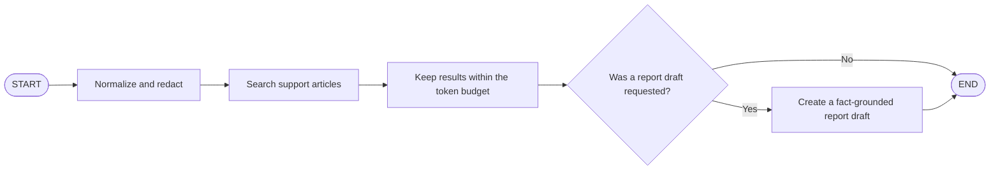
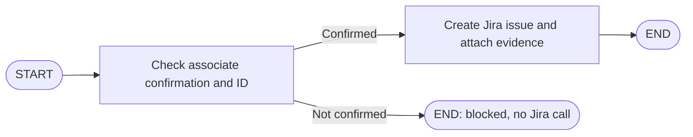

# LangGraph in ResolveDesk, Explained Simply

Imagine a parcel-sorting room. A parcel arrives, visits a few work stations, and each station does one job. The arrows between stations decide where the parcel goes next.

That is a useful way to picture a **LangGraph**. In ResolveDesk, the parcel is a small bundle of information about an application error. The stations are **nodes**, the arrows are **edges**, and the bundle passed between them is called **state**.

LangGraph is the traffic controller for these steps. It does not mean that the app is an all-knowing robot: most paths in this project follow the exact order written in Python.

## The Three Main Pieces

- **State:** the shared work form. It holds values such as the error title, description, search query, matching articles, and optional report draft.
- **Node:** one named job. A node reads the current state and returns the values it changed.
- **Edge:** a connection saying which node runs next.

`START` means the graph begins here. `END` means it is finished.

The state shape for the resolution flow is described by `IssueState`, a Python `TypedDict` in `smartissue/graphs/state.py`. A `TypedDict` helps the code and editors understand which keys are expected; at runtime, the state is still an ordinary Python dictionary.

## How We Build a Graph in This Project

The code uses LangGraph's `StateGraph` builder. The common recipe is:

1. Choose a state type, such as `IssueState`.
2. Create a builder: `StateGraph(IssueState)`.
3. Add named nodes with `add_node(name, function_or_subgraph)`.
4. Connect them with `add_edge(...)` or, when a decision is needed, `add_conditional_edges(...)`.
5. Call `compile()` to turn the description into a runnable graph.
6. Call `invoke(initial_state)` to run it with real values.

Here is the small triage supervisor from `smartissue/graphs/triage.py`:

```python
graph = StateGraph(IssueState)
graph.add_node("intake_agent", build_intake_agent())
graph.add_node("resolution_agent", build_resolution_agent(knowledge_base))
graph.add_node("issue_summary_agent", build_issue_summary_agent(knowledge_base))
graph.add_edge(START, "intake_agent")
graph.add_edge("intake_agent", "resolution_agent")
graph.add_edge("resolution_agent", "issue_summary_agent")
graph.add_edge("issue_summary_agent", END)
runnable = graph.compile()
```

`build_intake_agent()` and the other `build_*_agent()` functions return compiled, smaller graphs. The supervisor adds those subgraphs as its nodes. This is called **composition**: build small workflows, then connect them into a larger workflow.

## The Main Resolution Graph



The real supervisor has fixed edges:

```text
START -> intake_agent -> resolution_agent -> issue_summary_agent -> END
```

### Station 1: Intake

`smartissue/agents/intake.py` makes the intake subgraph. Its `normalize_and_redact` node cleans the title and description and creates a short search query. For example, it takes a payment error's title and details and turns them into text that can be searched against the help articles.

### Station 2: Resolution search

`smartissue/agents/resolution.py` builds a subgraph with two nodes:

```text
START -> semantic_retrieval -> token_budget_optimizer -> END
```

- `semantic_retrieval` asks the local knowledge base to find similar articles.
- `token_budget_optimizer` keeps the selected results within the configured context budget.

Each node returns a small dictionary containing the values it updates. LangGraph merges those updates into the shared state, so the next station can use them.

### Station 3: Optional issue summary

`smartissue/agents/issue_summary.py` adds a `fact_grounded_issue_draft` node. The graph always reaches this node, but the node checks `draft_requested`. If it is false, it returns an empty draft and finishes. If it is true, it calls the draft builder using the known issue facts and retrieved support references.

So the guidance search does not need to create a report draft. The two jobs share the graph state, but drafting is optional.

## How the App Starts the Graph

When an associate clicks **Get resolution guidance**, the Streamlit code sends the current error to `triage_application_error()` in `smartissue/host_adapter.py`. That calls `run_triage()` in `smartissue/graphs/triage.py`.

`run_triage()` prepares the initial state dictionary. It includes the error title and description, and starts values such as `query`, `matches`, and `issue_draft` as empty. It then calls:

```python
graph.invoke(initial_state)
```

LangGraph runs the nodes along their edges and returns the final state. The app reads `matches` from that state and shows the source articles and steps to the associate.

## The Other Two Graphs

### Evidence graph

In `smartissue/evidence.py`, the evidence graph is:

```text
START -> screenshot_sanitizer -> diagnostic_log_redactor -> END
```

The first node validates and re-encodes the screenshot. The second builds or cleans the diagnostic log and redacts sensitive-looking values. The graph returns the sanitized evidence for review and the report flow.

### Jira graph

In `smartissue/jira.py`, the Jira graph has a real branch:



The `associate_confirmation_gate` node checks that the associate confirmed and that an associate ID is present. `add_conditional_edges()` sends confirmed requests to `jira_issue_creator`; all others go straight to `END` with status `blocked`. The creator then calls the Jira REST API. Jira configuration is checked separately before the request is made.

This is the only **conditional edge in these LangGraph graphs**. Other nodes can still contain ordinary Python `if` statements; those are checks inside a node, not graph branches.

## What LangGraph Does Not Do Here

- It does not decide on its own which tools to use.
- It does not invent the resolution steps.
- It does not call the Jira MCP server. The app calls its Python functions directly.
- It does not make the Jira request unless the confirmation gate allows the Jira graph to reach the creator node.

The graph follows the nodes and connections declared in code. This makes the workflow easier to trace: when something goes wrong, you can inspect the state at each station and see which edge runs next.

## One-Line Summary

**LangGraph is the route map: it passes the error through named Python jobs in a known order, carries their shared state, and only takes a different route where the code explicitly defines a decision.**
